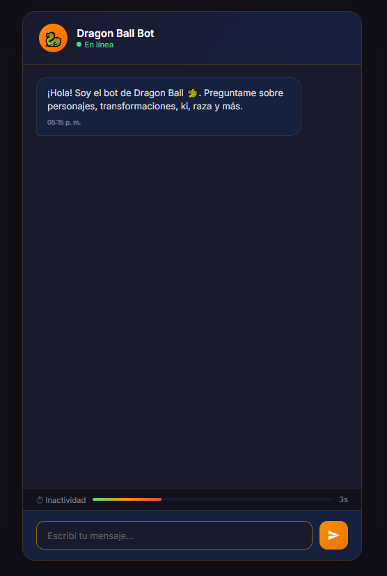
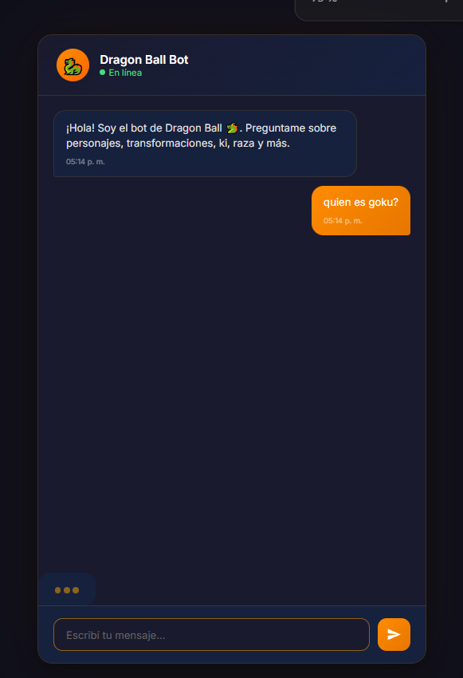
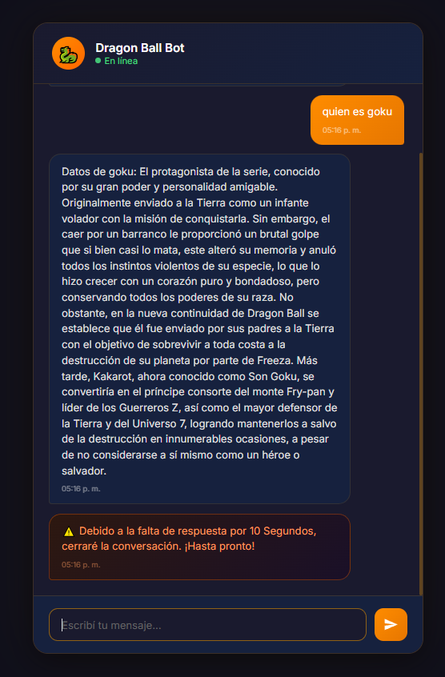
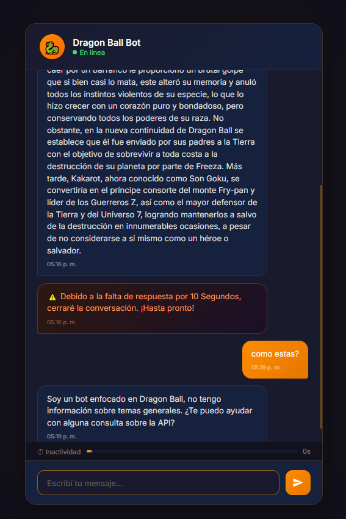

# Chatbot Dragon Ball - TP2 IA 2026

## GRUPO E - Martin Milton, Andrian Alexis, Pasutti Tomas, Arrua Leonel

<table align="center">
  <tr>
    <th>1. Saludo inicial</th>
    <th>2. Consulta a la API</th>
  </tr>
  <tr>
    <td></td>
    <td></td>
  </tr>
</table>

<table align="center">
  <tr>
    <th>3. Respuesta de la API y No-Input</th>
    <th>4. Chitchat</th>
  </tr>
  <tr>
    <td></td>
    <td></td>
  </tr>
</table>

## 📦 Instalación inicial

> Estos pasos son necesarios únicamente la primera vez que se descarga el proyecto.

### 1️⃣ Crear entorno virtual

```powershell
py -3.10 -m venv .venv
```

---

### 2️⃣ Activar entorno virtual

```powershell
.\.venv\Scripts\Activate.ps1
```

---

### 3️⃣ Actualizar pip

```powershell
python -m pip install --upgrade pip
```

---

### 4️⃣ Instalar dependencias

```powershell
pip install -r requirements.txt
```

---

### 5️⃣ Verificar instalación de Rasa

```powershell
rasa --version
```

---

## 🚀 Pasos para ejecutar el bot

### 1️⃣ Abrir la primera consola

Activar el entorno virtual:

```powershell
.\.venv\Scripts\Activate.ps1
```

> Los siguientes comandos son específicos de mi PC:

```powershell
Remove-Item Env:CURL_CA_BUNDLE -ErrorAction SilentlyContinue

Remove-Item Env:REQUESTS_CA_BUNDLE -ErrorAction SilentlyContinue
```

Ejecutar las acciones de Rasa:

```powershell
rasa run actions
```

---

### 2️⃣ Abrir una segunda consola

Ejecutar el servidor principal de Rasa:

```powershell
rasa run --enable-api --cors "*"
```

---

### 3️⃣ Abrir la interfaz web

Desde la carpeta `chatbot\y`, ejecutar:

```powershell
start chat.html
```

Esto abrirá el chatbot en el navegador. La otra forma de hacerlo es abriendo el archivo `chat.html` con doble click.

---

# 🔄 Qué hacer si modificás archivos

| Archivo modificado | Acción necesaria |
|---|---|
| `nlu.yml` | `rasa train` |
| `rules.yml` | `rasa train` |
| `domain.yml` | `rasa train` |
| `actions.py` | Reiniciar `rasa run actions` |

---

## ⚠️ Importante

Si modificaste `domain.yml` y agregaste una acción nueva:

```powershell
rasa train
```

y después reiniciá:

```powershell
rasa run actions
```

<br>

## ¿Qué es Rasa?
* **Framework de código abierto:** Basado en aprendizaje automático (Machine Learning) para la creación de asistentes conversacionales.
* **Estructura lógica:** Utiliza archivos de configuración para organizar la comprensión del lenguaje y la toma de decisiones.
* **Capacidades externas:** Permite la conexión a APIs para dotar al bot de funciones transaccionales y acceso a datos en tiempo real.

<br>

## ¿Qué es un chatbot y cómo funciona?
* **Definición:** Sistema de software diseñado para procesar lenguaje natural y simular interacciones lógicas con humanos.
* **Motores de Rasa:**
  * **NLU (Natural Language Understanding):** Interpreta el texto para extraer la intención del usuario y datos clave (entidades).
  * **Core:** Gestor de diálogo que evalúa el contexto histórico para predecir la siguiente acción.
* **Arquitectura modular:** Separa estrictamente la comprensión lingüística de la lógica de negocio técnica.

<br>

## Arquitectura de archivos en Rasa

### `nlu.yml` (Datos de Entrenamiento)
* Almacena ejemplos de frases para entrenar los modelos de clasificación.
* Ayuda al bot a identificar la intención real (*intent*) detrás de diversas formas de escribir.

### `domain.yml` (Registro de Componentes)
* Funciona como el inventario central o manifiesto del sistema.
* Declara intenciones, acciones y plantillas de respuesta (*utterances*) que el bot puede utilizar.

### `rules.yml` (Lógica Invariable)
* Establece reglas rígidas que fuerzan acciones específicas ante condiciones exactas.
* Se utiliza para flujos que no requieren predicción estadística, como el *chit-chat* o la inactividad.

### `config.yml` (Pipeline de Procesamiento)
* Define los hiperparámetros y algoritmos de IA (tokenizadores, clasificadores como *DIETClassifier*).
* Configura cómo se procesará el texto durante la fase de entrenamiento.

### `endpoints.yml` (Enrutamiento de Servicios)
* Gestiona las conexiones entre el núcleo de Rasa y servicios externos.
* Especifica la ubicación del servidor de acciones personalizadas (Action Server).

### `credentials.yml` (Autenticación de Canales)
* Centraliza tokens y claves de seguridad.
* Habilita la integración con plataformas como Slack, Telegram o interfaces web.

### `actions.py` (Capa de Ejecución)
* Script en Python que contiene la lógica de backend del asistente.
* Ejecuta tareas fuera del modelo predictivo de lenguaje.

<br>

## Rol de la integración con API
* **Desacoplamiento:** Separa la comprensión del diálogo de la gestión técnica de datos.
* **Flujo asíncrono:** El bot predice la necesidad de datos y delega la petición HTTP al script `actions.py`.
* **Procesamiento de datos:** El servidor de acciones maneja la respuesta de la API (JSON) y devuelve la información procesada al núcleo.
* **Estabilidad:** Evita bloqueos en la interfaz de usuario ante latencias o errores en servicios externos.

<br>
